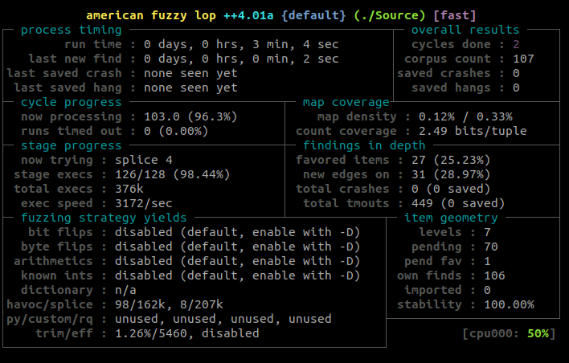
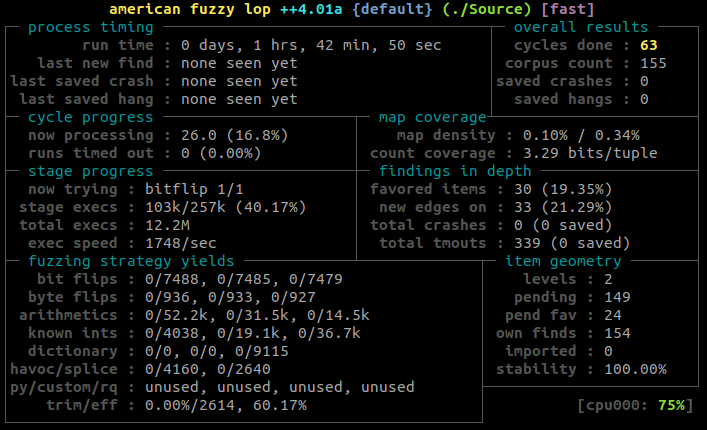
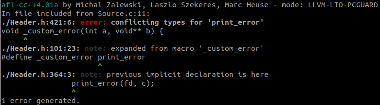
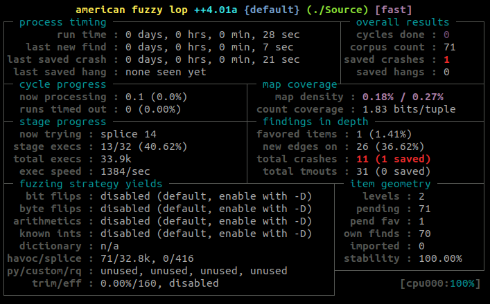

+++
title = "FuzzForFun"
description = ""
weight = 10
+++

Challenge statement:
```
Fuzz the parser and find the bug! The goal is to find a reproducible bug in the ESIF parser. We're looking for an exploitable vulnerability. "Theoretical bugs" or code warnings are not welcome, sorry.
```

After downloading the [zip](FuzzForFun-20220506T164604Z-001.zip) file, we could read the content of the HOWTO, which gives a very big help on where to start:
```
1) The goal is to find a reproducible bug on the ESIF parser. We're looking for an exploitable vulnerability. "Theoretical bugs" or code warnings are not welcome, sorry.
2) The challenge is intended to be solved by fuzzing, but creative approaches will be encouraged.
3) You can build the parser with: 
	gcc Source.c -o Source -lcrypto -lssl -lm -w
4) Then you can parse the example file with the following command:
	./Source example.ESIF output
5) I recommend you to use AFL++, but you can use whatever other fuzzer you want.
6) Once you have a crash file, you can get the flag with the following command:
	./Check <CrashFile>
7) Enjoy!
TIP: Take a look at https://github.com/antonio-morales/Fuzzing101
```

Based on [Exercise 1](https://github.com/antonio-morales/Fuzzing101/tree/main/Exercise%201), we can install afl++.

We can create an "examples" and "outputs" folder, and put the example.ESIF into the examples folder.
```bash
sudo apt-get install -y build-essential python3-dev automake git flex bison libglib2.0-dev libpixman-1-dev python3-setuptools
sudo apt-get install -y lld-11 llvm-11 llvm-11-dev clang-11 || sudo apt-get install -y lld llvm llvm-dev clang 
sudo apt-get install -y gcc-$(gcc --version|head -n1|sed 's/.* //'|sed 's/\..*//')-plugin-dev libstdc++-$(gcc --version|head -n1|sed 's/.* //'|sed 's/\..*//')-dev

cd $HOME
git clone https://github.com/AFLplusplus/AFLplusplus && cd AFLplusplus
export LLVM_CONFIG="llvm-config-11"
make distrib
sudo make install
```

During the installation, you need to make sure that you fix whatever problem that comes up during those steps. I was missing cmake and gcc-X-plugin-dev, which in my case was gcc-9-plugin-dev.

We can then compile our executable with the AFL instrumentation and start the fuzzer with the following:
```bash
export LLVM_CONFIG="llvm-config-11"
CC=$HOME/AFLplusplus/afl-clang-fast CXX=$HOME/AFLplusplus/afl-clang-fast++ $HOME/AFLplusplus/afl-gcc-fast Source.c -o Source -lcrypto -lssl -lm -w
/usr/local/bin/afl-fuzz -i examples -o outputs -s 123 -- ./Source @@ outputs/output
```


Now it's time to wait. While waiting, I also tried to run it in a docker container, to see if the speed would be better than a VM, but it was not. For references, here are the steps to make it work in a docker container:
```bash
docker run -ti -v "$(pwd):/home" aflplusplus/aflplusplus
export HOME="/home"
afl-gcc Source.c -o Source -lcrypto -lssl -lm -w
afl-fuzz -i examples/ -o outputs/ -s 123 -- ./Source @@ outputs/output
```

At some point I tried to enable bit/byte flips and such by using the -D switch.
```bash
AFL_AUTORESUME=1 /usr/local/bin/afl-fuzz -D -i examples -o outputs -s 123 -- ./Source @@ outputs/output
```



After more than an hour, I thought that maybe I had to try a different approach. I looked into trying to give more information on the file structure of the input to AFL, but I wasn't even sure what the program expected, or how to do such thing with AFL.

I decided to run the check program on the sample output, to see the result, and it gave the following:
```bash
$ ./Check output
nsec2022_2665387
```
Maybe that number is a hint on which seed to use, so I tried to run it with the seed being 2665387. With or without the -D option, it did not do much better.

I decided to keep reading those exercises, and finally got to [Exercise 3](https://github.com/antonio-morales/Fuzzing101/tree/main/Exercise%203). One thing that it brings up is to use afl-clang-lto instead of afl-gcc/afl-gcc-fast to compile the application. I ended up having other issues, and didn't think I was supposed to fix the compilation problems.\


The other thing that Exercise 3 was doing differently was to build with ASan, the Address Sanitizer, enabled. So I tried

```bash
AFL_USE_ASAN=1 CC=$HOME/AFLplusplus/afl-clang-fast CXX=$HOME/AFLplusplus/afl-clang-fast++ $HOME/AFLplusplus/afl-gcc-fast Source.c -o Source -lcrypto -lssl -lm -w

AFL_AUTORESUME=1 /usr/local/bin/afl-fuzz -i examples -o outputs_123_ASAN -s 123 -- ./Source @@ outputs/output
```

And right away, I got a crash.\


Looking in the outputs_123_ASAN's crashes folder, I could see 1 interesting file. Time to try giving it to the Check utility:
```bash
./Check outputs_123_ASAN/default/crashes/id\:000000\,sig\:06\,src\:000000\,time\:7398\,execs\:4154\,op\:havoc\,rep\:4 
nsec2022_8831357
```

And we got the last flag of the warmup!