+++
title = "Hidden Hardware Secrets"
description = ""
weight = 9
+++

Challenge statement:
```
We were sneaking around NorthSec before it started and found a hardware device. Taking apart the device, we found a serial interface and sniffed some data with our Saleae logic analyzer. Can you help us decode what we captured?
```

Another logic analyzer challenge, so we can start by downloading the [hw_hacking.sal](hw_hacking.sal) file. I tried to open the file in Pulseview Sigrok like I did for [warmup challenge, logically](nsec-2022-warmup/warmup-challenge-logically/), but got a generic/unspecified error.

Searching online what I could do with a .sal file, I ended up on this other [CTF writeup](https://kashmir54.github.io/ctfs/CyberApocalypse2021/) which probably gave me a bit more than what I was supposed to get.

We can start by downloading the [Logic2 application](https://www.saleae.com/downloads/) and open an existing capture.\
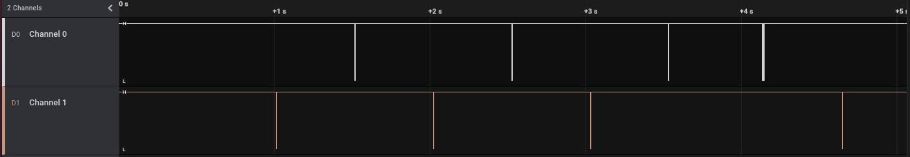

We can see a few exchanges, and zooming on the first one, we can find the smallest period of the signal.\
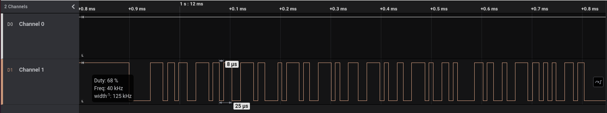

Doing the same maths, we can calculate a rate of 125,000 bits/second. Using the same list of [standard baud rates](https://electronics.stackexchange.com/questions/9264/what-standard-uart-rates-are-there), we will find the same nearest rate of 115,200.

We can now set an Analyzer, of type Async Serial, with that specific bit rate.\
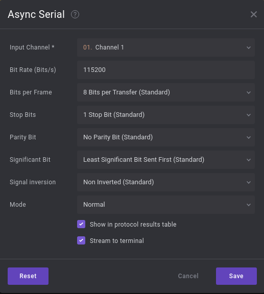

We can also change the output type from hexadecimal to ascii.\
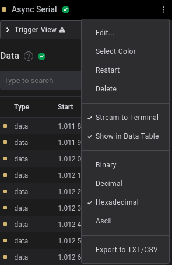

Once that is done, we can take a look at the first message.\
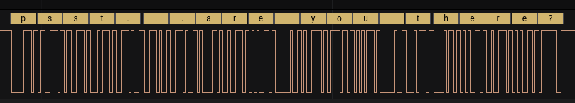

That is good, we can see the messages clearly. Either we change the current Analyzer to look at the other channel, or we add a new analyzer for the other channel. In reality I just peek toward the end and as you will see, moved backward to see where I went wrong.

The conversation went as following:\
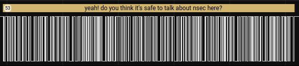\
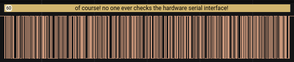\
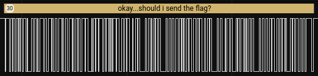\
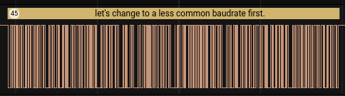\
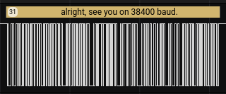

The next message, as I saw it, without the transformation to the new 38400 baud, was as following.\
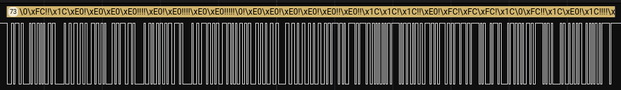

Once we change the Analyzer to the right bit bit rate, we got the following:\
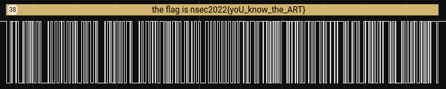\
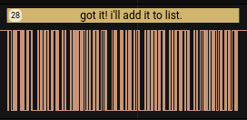

And we now have the flag: nsec2022{yoU_know_the_ART}