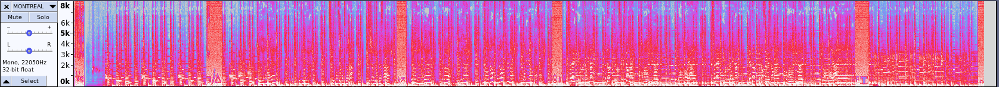

+++
title = "Montréal Remix"
description = ""
weight = 11
+++

Challenge statement:
```
I play this tune every time I'm headed home and land at Montréal-Pierre Elliott Trudeau International Airport! It has a special meaning for this year. Can you find it?
If you do, we have something special for you at the NSEC shop! (while supplies last)
⚠️ Warning: This remixed version of the song has some really loud parts. Keep your volume low.
Flag format: nsec2022{}
```

After downloading the [file](MONTREAL.mp3), we can start with a safe first step: Getting information with exiftool!

```
ExifTool Version Number         : 11.88
File Name                       : MONTREAL.mp3
Directory                       : .
File Size                       : 607 kB
[...]
File Permissions                : rw-rw-r--
File Type                       : MP3
File Type Extension             : mp3
MIME Type                       : audio/mpeg
MPEG Audio Version              : 2
Audio Layer                     : 3
Sample Rate                     : 22050
Channel Mode                    : Single Channel
MS Stereo                       : Off
Intensity Stereo                : Off
Copyright Flag                  : False
Original Media                  : True
Emphasis                        : None
VBR Frames                      : 2722
VBR Bytes                       : 620964
VBR Scale                       : 80
Encoder                         : LAME3.100.n.
ID3 Size                        : 203
Title                           : Montréal
Year                            : 1969
Warning                         : [minor] Frame 'TDRC' is not valid for this ID3 version
Recording Time                  : 1969
Album                           : Dcode & Audacity
Genre                           : Criminoly/Cryptography
Track                           : 408
Artist                          : Ariane Moffatt ft. The Zodiac Killer, The Hardens
Date/Time Original              : 1969
Audio Bitrate                   : 69.9 kbps
Duration                        : 0:01:11 (approx)
```

We can search about the invalid TDRC frame warning, but after installing a few more tools, I gave up on that.

It was clear that multiple keys among the last ones had been modified by the challenge creator.

Opening the file in Audacity, and listening to the song shows us some definitive artifacts.\


I decided that maybe there was a way to get the true song out of Youtube and do some kind of diff between the real song and this song to see what was done to it. I decided to search for the full artist name `Ariane Moffatt ft. The Zodiac Killer, The Hardens`. Strangely enough, I couldn't find the song right away. It took some tries and changing my search but I finally found the Montreal song. I used a third party website to download it to MP3 and tried to compare the two in Audacity. I couldn't find a good way to import both tracks in Audacity to do the diff, and comparing the two tracks in two different windows was not very promising. Time to start again... 

I decided to use Audacity's tool to show the track from Waveform to Waveform(DB), and then to Spectrogram, which resulted in the following:\


We can definitively see a few strange characters in the Spectrogram, so we can delete the parts of the song that was not altered and see a better picture.\


We can even set the scale to Logarithmic, and configure the Spectrogram's settings to set the minimal frequency to 100Hz.\
\


At that point, we were clearly on the right path to get the flag, but the next took a while to figure out. I originally thought those characters were Unicode, and started searching on how it could be translated to something that would look like a flag. I then went down the font rabbit hole, thinking it could be Wingdings or a similar one.

Maybe I was wrong, and this picture was just a lure to mess with us. I decided to go back to basics, trying with Strings on the file, and look back at the exiftool output.

```
Album                           : Dcode & Audacity
Genre                           : Criminoly/Cryptography
```
An interesting typo was made in the word Criminology, so that could be a hint as some kind of cryptography method! Combining the word `Criminoly` with Cryptography, we can try to find what type of cryptography was used in the challenge. Searching about that, or searching about `Criminoly Dcode` did not give a lot of good results. Searching for Criminoly on [dcode](https://www.dcode.fr/), didn't give anything. After a little while, I gave up again... maybe it was simply a true typo... :(

I finally remembered that the Artist information was wrong!
```
Artist                          : Ariane Moffatt ft. The Zodiac Killer, The Hardens
```
Yeah, who are The Hardens!?

So I searched about the Hardens, and found [The Harden Trio](https://en.wikipedia.org/wiki/The_Harden_Trio). What are they about?

...

Nothing really came out of that search, what is going on?

So I searched for `the hardens the zodiac killer`, and multiple links came up talking about [The Zodiac Ciphers](https://www.history.com/news/the-zodiac-ciphers-what-we-know), [FBI Says Zodiac Killer Coded Message Has Been Solved](https://www.nytimes.com/2020/12/11/us/zodiac-killer-code-broken.html) and [FBI Confirms Zodiac Killer's Infamous 340 Cipher Has Been Decoded, And His Message Finally Revealed](https://www.iflscience.com/editors-blog/fbi-confirms-zodiac-killers-infamous-340-cipher-has-been-decoded-and-his-message-finally-revealed/). That's very interesting! Here's an example of the encoded characters:\


Finding the Zodiac Killer Cipher tool on [dcode](https://www.dcode.fr/zodiac-killer-cipher), we can search each character one by one and get the final answer:\
\


And the final flag was `nsec2022{BACKINPERSON}`.

After realizing what the Cipher was, we can go back and see the other oddentries in exiftool:
```
Year                            : 1969
Recording Time                  : 1969
Track                           : 408
Date/Time Original              : 1969
```

The Zodiac Ciphers were created in 1969, and we had to use the Z408 variant.