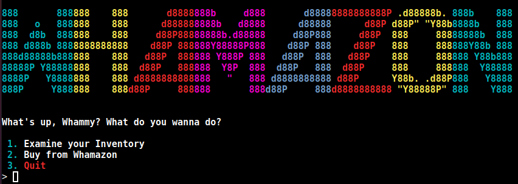
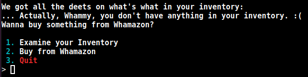
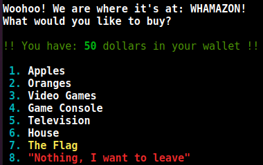
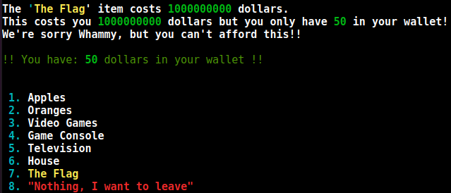
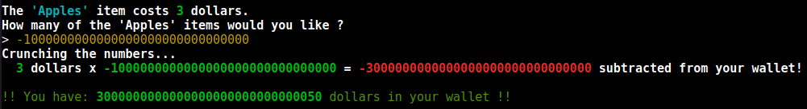
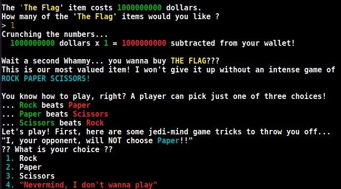
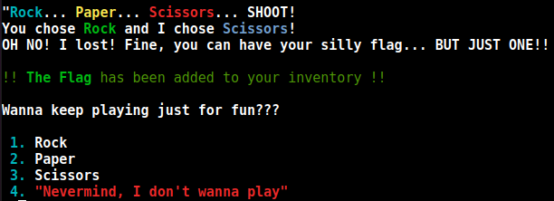
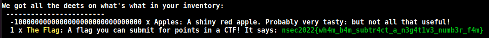

+++
title = "Whamazon"
description = ""
weight = 7
+++

Challenge statement:
```
Welcome to Whamazon(http://54.159.198.36:3000/)! Buy anything you would like... but I doubt you have enough money to purchase the flag!
```
Once we open the link, we get welcombed by a terminal-like interface that announce the goods of Whamazon:\


We have a few choices. We can start by taking a look at our inventory:\


We can move on pretty fast as we have nothing. We can then try to buy something, and see that we have 50$.\


We see the flag being offered, so let's try to buy it.\


Now that we know it's that expensive, there are multiple ways to approach this problem. We can start by either increasing our wallet, or decreasing the price of the flag. What if we tried to buy an apple. What if we tried to buy a negative amount of apples?\


Since we bought a negative amount of apple, the simple maths were done and we got money back in our wallet. Now we can try to buy the flag.\


Ok, second step of the challenge. Since this is a warmup challenge, this is only a logical question and if we believe the opponent, they will not chose paper. If they chose between Rock and Scissors, we know that we can't lose picking Rock.\


Now that they chose Scissors, we got the flag. Looking at our inventory, we can now see it in clear: nsec2022{wh4m_b4m_subtr4ct_a_n3g4t1v3_numb3r_f4m}.\

