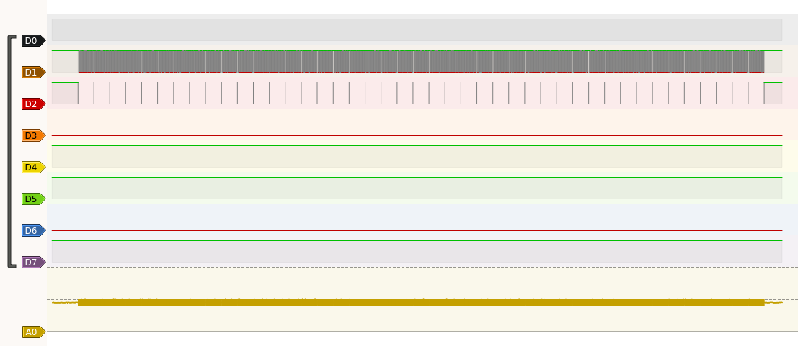
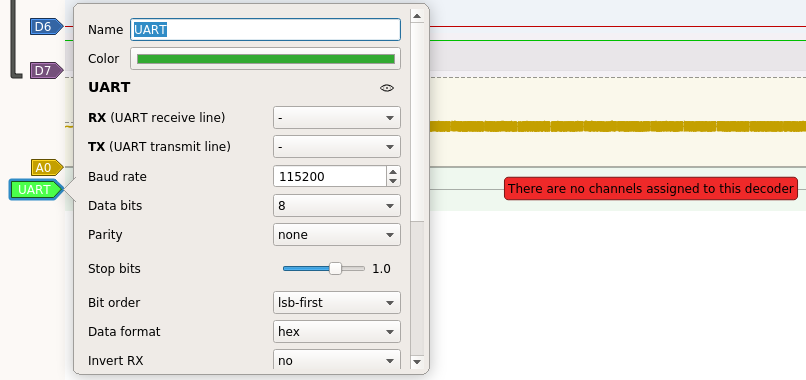
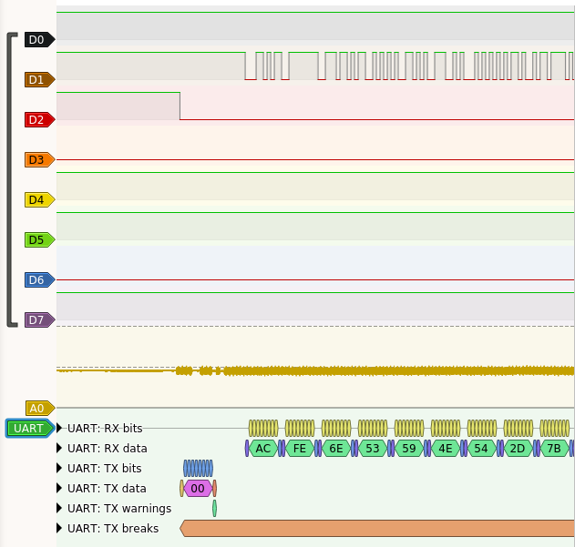
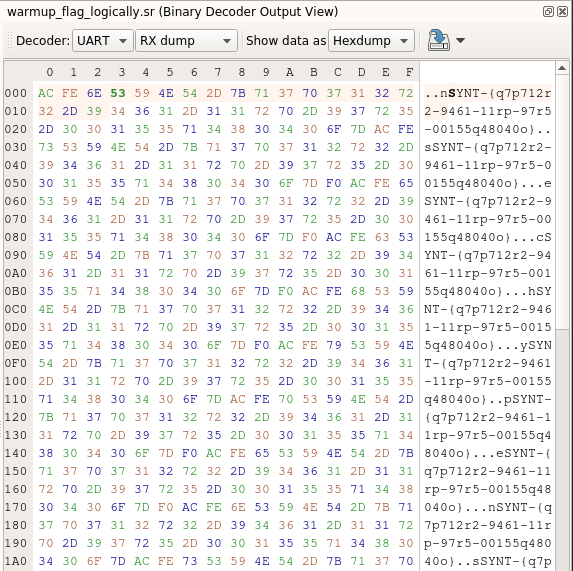
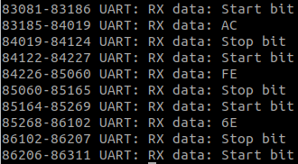
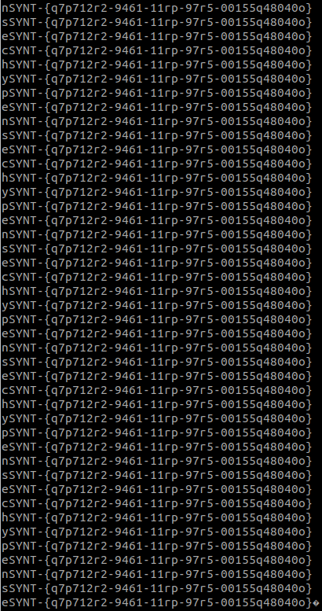
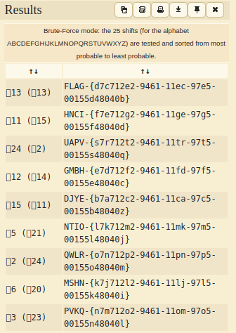

+++
title = "Warmup challenge, logically"
description = ""
weight = 2
+++

Challenge statement:
```
Here is a pulseview (sigrok) logic capture of some universal asynchronous flags; at least 9600 of them per second 😉
⚠️ : This challenge has a BONUS FLAG.
Flag format: FLAG-{ }
```

Once we download the [file](warmup_flag_logically.sr), we get a zip archive named warmup_flag_logicaly.sr. Searching for Pulseview Sigrok we end up on the [sigrok project](https://sigrok.org/wiki/PulseView), where we can download a tool to analyze that file.

After making that AppImage executable, we can open the file and see 8 digital channels and one analog.\


We can see information on channel 1 and 2, so we'll start by concentrating on that. After watching a few videos, reading more about the channels and decoders, and trying a few, we can add the proper protocol decoder, which is the Universal Asynchronous Receiver/Transmiter, or UART. A big hint was given in the challenge statement that should have been picked up earlier.\


We can set the RX and the TX as D1 and D2 respectively, and changing the Baud rate to 9600 like the challenge is saying. After zooming in greatly, we can start seeing data showing up.\


Opening the Binary Decoder Output View, we can see the result of the UART decoder.\


We can see that each block starts with 0xACFE and ends with 0x7D or 0x7DF0. 0x7D is the closing curly bracket "}". We can right click on the "UART: RX data" line in our graph to export all annotations for this row.\


Now, with a bit of bash-fu, we can line them up.
```bash
while read -r line; do echo $line | xxd -r -p; echo; done < <(grep -v bit rx_annotations | awk '{print $5}' | sed ':a;N;$!ba;s/\n//g' | sed 's/F0ACFE/\n/g;s/ACFE/\n/g')
```


nsechype!\
So we can see that all the lines are saying the same thing. The text almost fit the flag format, with the normal four letter prefix, curly bracket and content, but the letters at the front are wrong. It could be multiple thing, but with such a short text, and no more hints, we need to test if it is a Caasar Cypher. We can try it on the [dcode.fr site](https://www.dcode.fr/caesar-cipher) and brute force all 26 possibilities. From the result, we can see that it was a very specific substitution cypher: rot13.\
