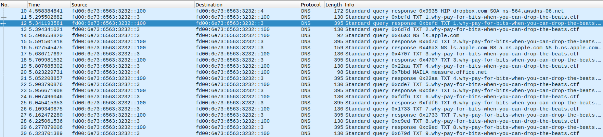
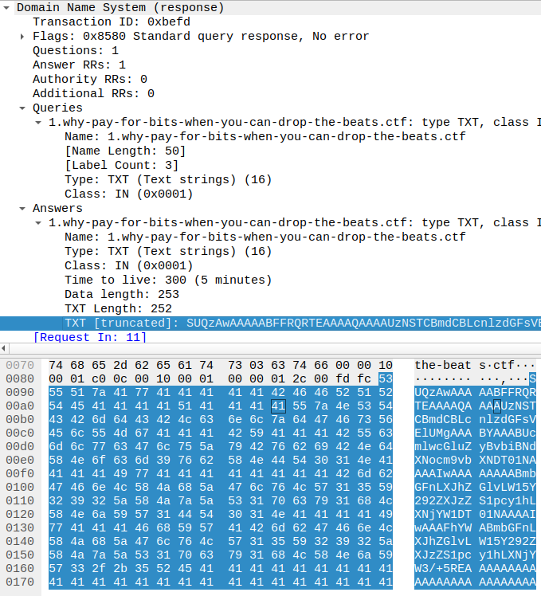
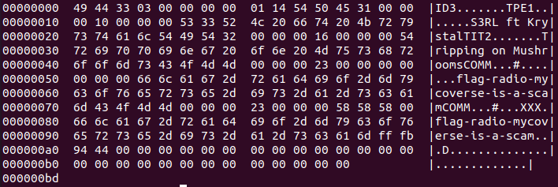

+++
title = "Portobello - Anger"
description = ""
weight = 4
+++

Challenge statement:
```
YOU HAVE NO RIGHTS TO USE THE DNS PROTOCOL MALICIOUSLY. Respect the RFCs spirit like any good technology user would.
Our vendor guaranteed us that nothing could get stolen from the Mycoverse and I still believe him.
Because any data leaving or entering the Mycoverse goes through our AI-backed deep packet inspection appliance, we have never had any user misuse our technologies.

They have no need to do so because anything a user would want is acquireable through our online store.

My AI appliance alerted me numerous time about large DNS responses from a single domain name but I deleted these alerts as false positives.
I don’t want to sound like a broken record but we both know that DNS is a benign protocol.

You can still try to find the traffic, I bet it is still happening.

Rosie Meyer - A+, Server+, CCNA, CCNP, CCIE, MSDST, CSM
Network Admin
```

We still need to download the same [pcap](../portobello53.pcapng).

The large DNS responses that the challenge statement is talking about can be found in the TXT records. We can see a lot of query and responses for TXT records in the why-pay-for-bits-when-you-can-drop-the-beats.ctf.\


Taking the first one, we can see that the content of the TXT response look like a base64 blob.\


We can use base64 to get some clear-ish text:
```bash
echo "SUQzAwAAAAABFFRQRTEAAAAQAAAAUzNSTCBmdCBLcnlzdGFsVElUMgAAABYAAABUcmlwcGluZyBvbiBNdXNocm9vbXNDT01NAAAAIwAAAAAAAABmbGFnLXJhZGlvLW15Y292ZXJzZS1pcy1hLXNjYW1DT01NAAAAIwAAAFhYWABmbGFnLXJhZGlvLW15Y292ZXJzZS1pcy1hLXNjYW3/+5REAAAAAAAAAAAAAAAAAAAAAAAAAAAAAAAAAAAA" | base64 -d
ID3TPE1S3RL ft KrystalTIT2Tripping on MushroomsCOMM#flag-radio-mycoverse-is-a-scamCOMM#XXXflag-radio-mycoverse-is-a-scam���D
```

We can see the first flag in there.
> flag-radio-mycoverse-is-a-scam

Flag submission:
```
Portobello 53 - Anger (1/2)      |     1 | This user did not buy this art on the Mycoverse (1/2)
```

Forum message:
```
What is that user downloading illegaly from a non-official server?
```

We can see that the previous blob was binary, and started with ID3. We can have a better look at it by sending it to hexdump -C:\


ID3 is a metadata container usually used in MP3. We can try to extract all the TXT record and create a single file out of them with this script:
```python
from scapy.all import *
import base64

raw = sniff(offline="portobello53.pcapng")

data = b''

for packet in raw:
    if packet[IPv6].src == 'fd00:6e73:6563:3232::100' and b'why-pay-for-bits-when-you-can-drop-the-beats' in packet[DNS].qd.qname and packet[DNS].ancount > 0:
        data = data + packet[DNS].an.rdata[0]

with open('output', 'wb') as f:
    f.write(base64.b64decode(data))
```

We can now use the file command to make sure what type of file it is:
```bash
$ file output
output: Audio file with ID3 version 2.3.0, contains:MPEG ADTS, layer III, v1, 128 kbps, 48 kHz, JntStereo
```

It's a bit hard to hear correctly, but when opening the [file](output) in an audio player, we can hear the last flag (SOUND WARNING).
> flag-radiocashmoneymushroom247

Flag submission:
```
Portobello 53 - Anger (2/2)      |     2 | When the beat drops, expect the stocks to do the same. This gives me grief. (2/2)
```

Forum message:
```
Listening to pirated radio channel from within the Mycoverse. I will let Eva and Anatoli know that we are missing out on profit.
```