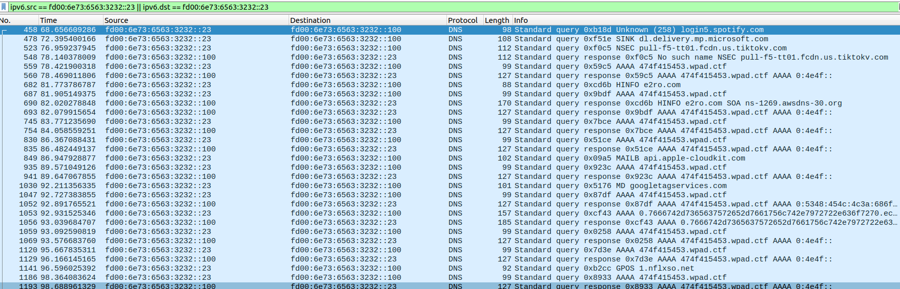
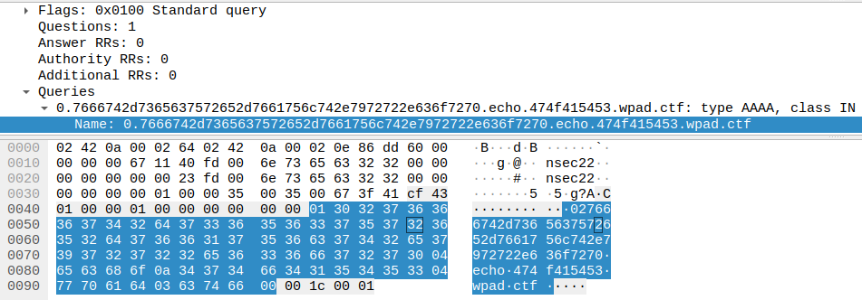
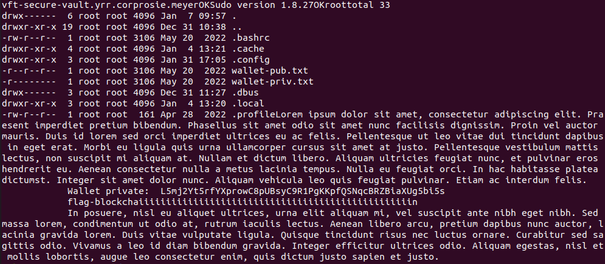
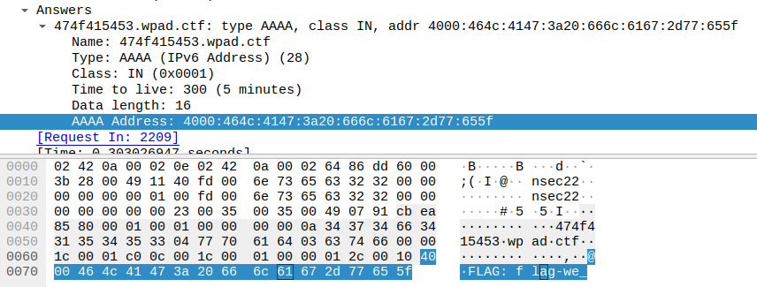
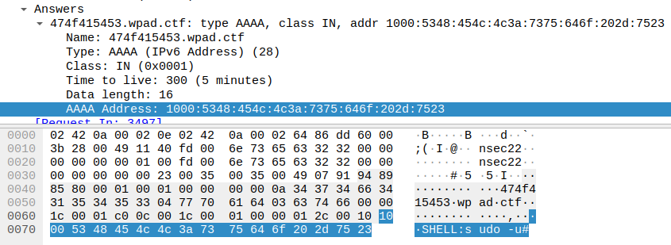
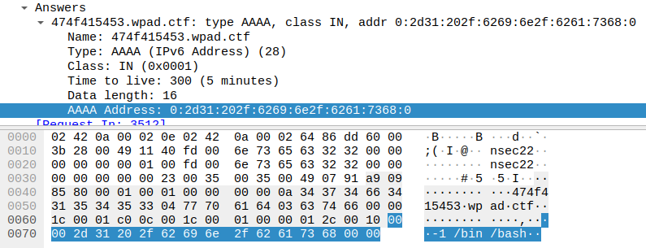

+++
title = "Portobello - Bargaining"
description = ""
weight = 3
+++

Challenge statement:
```
While you were wasting your time on the DNS server trafic, I had Dr Harold Moon, our resident data scientist, verify if he could find anything out of the ordinary.
He’s not an expert and has no active certifications under his name but he wanted you to know that the host at address fd00:6e73:6563:3232::23 was the only one presenting anomalies.
I am not a data scientist and have no idea what anomalies are. It’s probably benign because the AI-backed deep packet inspection appliance did not flag anything.

Dr Moon said he observed a lot of unusual “back and forth” with this address.

No appliance alert = not suspicious in my book.

Rosie Meyer - A+, Server+, CCNA, CCNP, CCIE, MSDST, CSM
Network Admin
```

We still need to download the same [pcap](../portobello53.pcapng).

We can start by filtering the same way we did in Denial, but with the right IP address (fd00:6e73:6563:3232::23).\


We can see some interesting calls make, like packet 1053, where the query has the word "echo" in it. The subdomain to echo also look like  a string we should be able to convert.
```
0.7666742d7365637572652d7661756c742e7972722e636f7270.echo.474f415453.wpad.ctf
```


The second section 7666742d7365637572652d7661756c742e7972722e636f7270 can be translated to vft-secure-vault.yrr.corp and the fourth one 474f415453 to GOATS. That one appears in every interesting request.

We can keep going by hand and finding other packets, like 1522, where the second value translate to rosie.meyer, but we should do it with some kind of script, else it will take a long time.

```bash
tshark -r portobello53.pcapng | grep wpad.ctf | grep "query 0x" | awk {'print $12'} | grep echo | cut -d. -f2 | xxd -r -p
```


We can find out first flag in the middle, right after the wallet's private key.
> flag-blockchaiiiiiiiiiiiiiiiiiiiiiiiiiiiiiiiiiiiiiiiiiiiiiiiiiin

It was actually the second flag, or the third one... I think there was a little issue with the numbering on that one.

Flag submission:
```
Portobello 53 - Bargaining (3/3) |     2 | Losing this private key is not looking great (2/3)
```

I didn't go check the forums before finding the next flag, but there was a new message hinting us on how to do the last one.

Forum message:
```
Our AI appliance was supposed to catch anything malicious and yet it let the private key to our wallet get leaked. This is bad for the company.

Can you also tell me which CVE was used to do priviledge escalation? I want to get ready to blame someone else.
Use this format: flag-bargaining_{MD5 hash of the string CVE-XXXX-YYYYYYYYYY} (without the {}).
```

For the first flag, I kept looking into wireshark and ended up around packet 2218 where we can clearly see some data in the hexadecimal reprensentation.\


Taking that packet and the next ones together, we can recreate the flag.
> FLAG-we_have_a_bad_case_of_ophiocordyceps_unilateralis

Flag submission:
```
Portobello 53 - Bargaining (1/3) |     2 | Why is that server returning commands? (1/3)
```

Forum message:
```
The DNS server is definitely sending commands to the host. What could go wrong?
```

For the last flag, we had to find the message on the forum. We can see from other packets that we see a query to get the version of sudo, and an execution of sudo -u#-1 /bin/bash. Looking for that specific version of sudo that we got earlier (1.8.27), lead us to an [exploit-db](https://www.exploit-db.com/exploits/47502) page informing us of the CVE : 2019-14287.\



We can use md5sum to generate the hash and submit our last flag.
> flag-bargaining_739d80f289f091f1d5faf12cfd25fe83

Flag submission:
```
Portobello 53 - Bargaining (2/3) |     1 | A yes, a good old MITRE ATT@CK T1548. Give us ways to cope on grief. (3/3)
```

Forum message:
```
Someone logged in as myself and managed to escalate their priviledges. Don’t tell the news.
```
