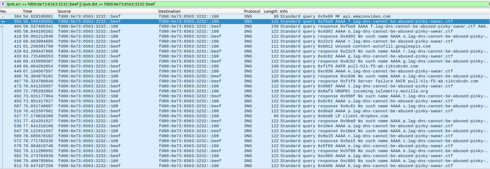
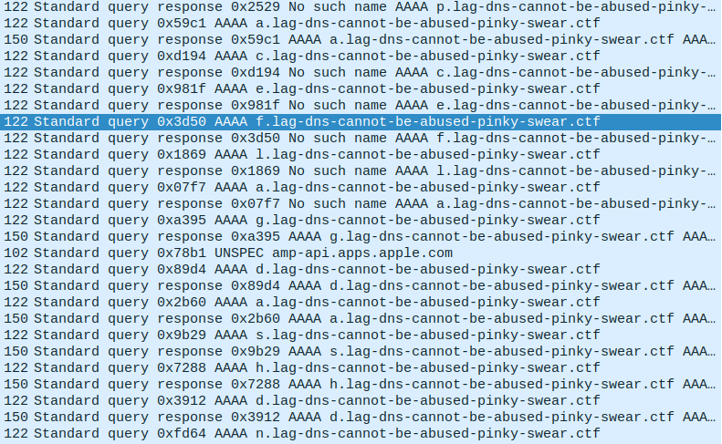
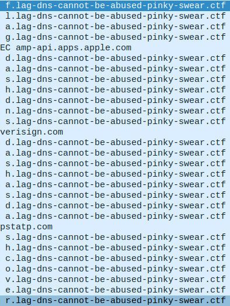

+++
title = "Portobello - Denial"
description = ""
weight = 1
+++

Challenge statement:
```
Any data leaving or entering the Mycoverse goes through our AI-backed deep packet inspection appliance.
The vendor told us that this box was what we needed. At this price tag, I know he’s right.

Why do you need DNS logs anyway?
We both know that DNS servers are just address books of Internet resources and I’ve never seen anyone abuse a plain old address book.

The appliance would have blocked anything malicious anyway.
I bet you don’t even have a certification to understand the protocol anyway.

Don’t waste your time on the network capture, I skimmed throught it and found that your test device fd00:6e73:6563:3232::beef did nothing suspicious.

Rosie Meyer - A+, Server+, CCNA, CCNP, CCIE, MSDST, CSM
Network Admin
```

We need to download the [pcap](../portobello53.pcapng). This is going to be the same pcap for all Portobello challenges.

We can start by taking a look at what we have. In wireshark, we can use the following filter to see only what is related to the ip at hand `ipv6.src == fd00:6e73:6563:3232::beef || ipv6.dst == fd00:6e73:6563:3232::beef`.\


We can see that the subdomain to lag-dns-cannot-be-abused-pinky-swear.ctf in the first query is f, then o, then r... So we can keep scrolling trying to see what it could be. We end up very soon on the word flag:\
forgetspaceaboutspacesafespaceprotocolsspace **flag** dashd...\


We can filter on queries only, and see even better what is getting written out:\


By reading it until we get to the next "space" word, we can get the first flag.
> flag-dns-as-covert-communication-channels

Flag submission:
```
Portobello 53 - Denial (1/2)     |     1 | I hope the server can interpret covert queries (1/2)
```

Forum message:
```
I bet this is just a malformed DNS query. There’s no way a server would answer to this.
```

The forum message was the hint for the other flag. The answer is key to understanding which subdomain is important.

Looking at the patterns, we can see that there is a lot less successful responses than NXDOMAIN. We can filter them and get all the successful answer's subdomains together with this:
```bash
$ tshark -r portobello53.pcapng -Y "ipv6.dst == fd00:6e73:6563:3232::beef" | grep pinky | grep -v "No such" | awk '{print $13}' | cut -d. -f1 | tr -d '\n'
flagdashdnsdashserverhidinginternetnoise
```
This gives us the flag:
> flag-dns-serverhidinginternetnoise

Flag submission:
```
Portobello 53 - Denial (2/2)     |     1 | Ouch - A two-way covert communication channel. Watch the client proceed to the next stage of grief (2/2)
```

Forum message:
```
A server answering correctly to your arbitrary DNS queries. That’s not the kind of thing that would take the Mycoverse down.
```