+++
title = "Portobello - Depression"
description = ""
weight = 2
+++

Challenge statement:
```
What do you want again? Don’t you think you’ve caused enough harm to the company already?
Cyber security is only an expense. You can’t profit from being secure. It is a money drain.

Our AI-based deep packet inspection appliance is guaranteed to prevent theft from the Mycoverse.

There is nothing left to uncover from the network traffic of the DNS server, I swear.
DNS is a safe protocol when you stick to ASCII characters and our appliance only supports this encoding.

Even if someone can infiltrate the Mycoverse, there is no way that they can get our intelectual property out of the network.

🚩 This is making me think 🤔 Are the DNS queries made by our users only in ASCII?

Rosie Meyer - A+, Server+, CCNA, CCNP, CCIE, MSDST, CSM
Network Admin
```

We still need to download the same [pcap](../portobello53.pcapng).

Through the pcap, we can see some interesting queries being made that start with xn--. This type of encoding is named punycode and allows us to use unicode in places where you usually can't.\
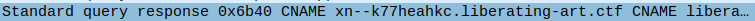

We can use an online converter to get the unicode character out of them.\
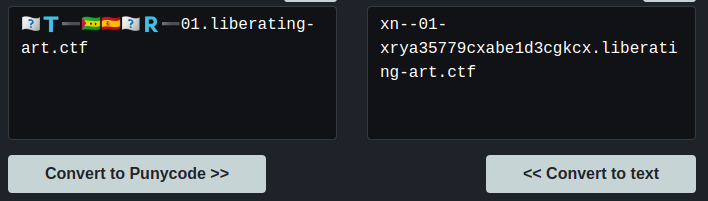

To get a better look, we can filter only for the IP making those queries, fd00:6e73:6563:3232::9 and only for DNS queries of type CNAME.\
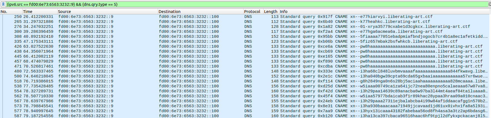

Doing the first few by hand, we get to the fifth one and find something that could look like the start of a flag.\
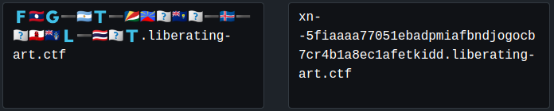

We now had to figure out which country each flag was, and replace the flags with the county's code from the unicode character. An easy way that I used was to paste them in discord, and hovering with the mouse to get the emoji's name. That way, we get most of the flag:
> FLAG-ART-SCRE??SH??-IS-??GITAL-TH??T

We're missing a few flags, but we can guess the rest
> FLAG-ART-SCREENSHOT-IS-DIGITAL-THEFT

Flag submission:
```
Portobello 53 - Depression (1/3) |     2 | The Mycoverse needs it’s own flag (1/3)
```

Forum message:
```
The user found a way to exfiltrate informations using country flags? Where can I get a certification for this?
```

After that, I kept going and reading the other domains. It was pretty fun and got some like that one:\


I did a dozen or two by hand, and this is what I got:\
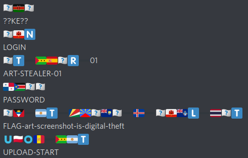\
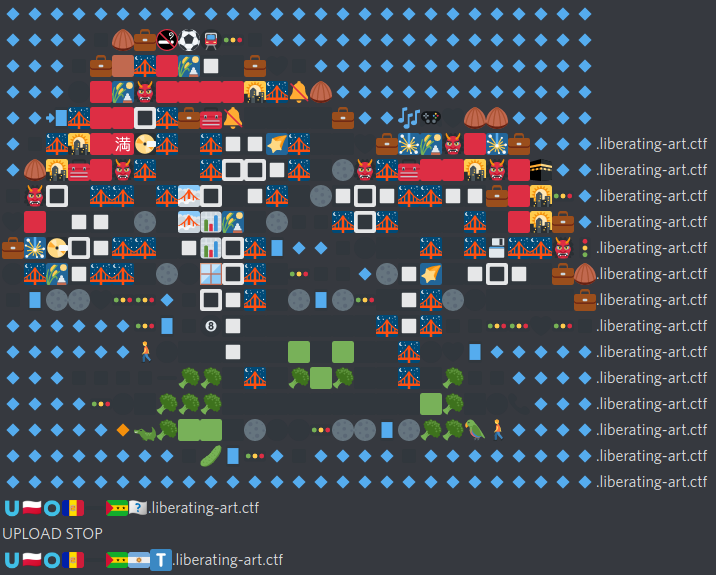

At that point, that last line, I knew what it was... "UPLOAD START"... and no, I didn't want to keep doing it by hand. There was a total of 1223 packets that were containing a punycode CNAME....

Time to bring out bash once again:
```bash
tshark -r portobello53.pcapng | grep libera | grep "query 0x" | awk {'print $12'}
```
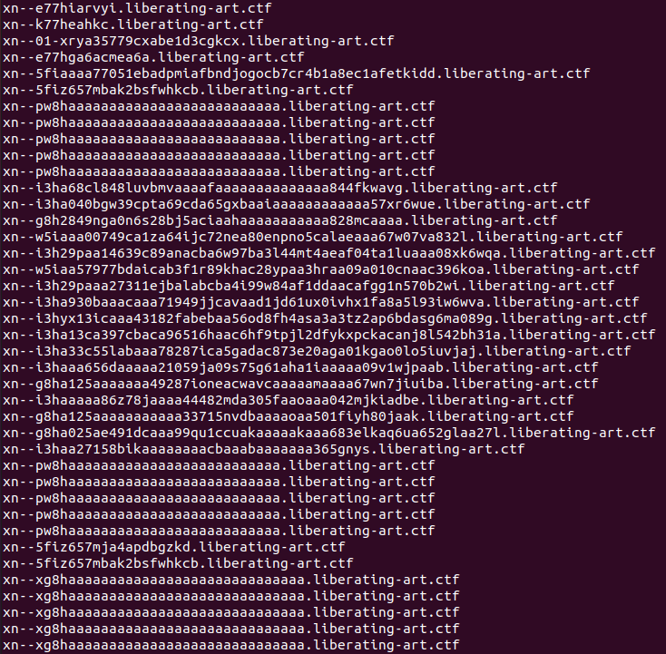

Sending them all in a file, we can use this [Punycode Converter](https://seoengineoptimizations.com/seotools/idnconverter.php) to do more than one at a time. Loading the file with "Import Urls" and selecting "Punycode to IDN".
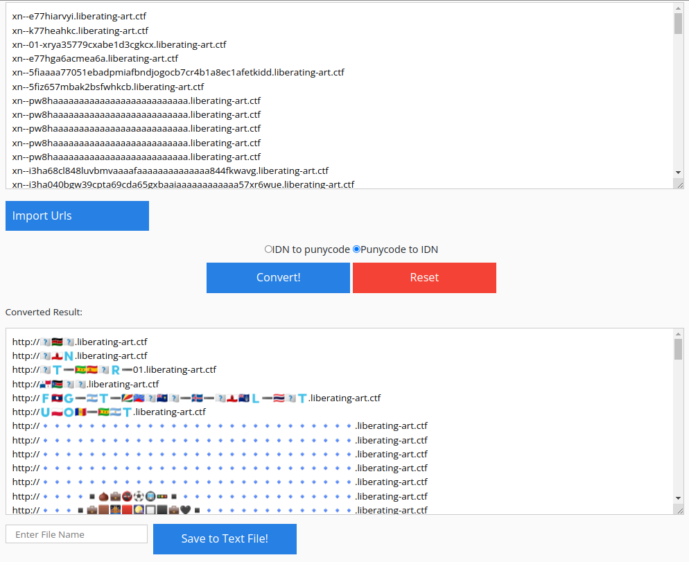

Scrolling down, we can start to see some form that are letters. Here's the first one:\
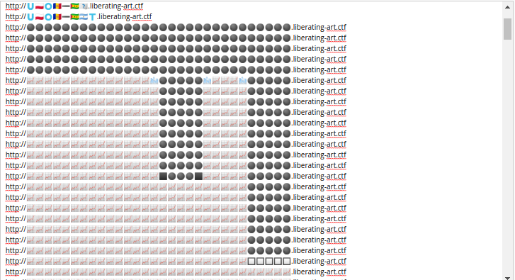

By zooming the way down to 25% we can get a better view.\
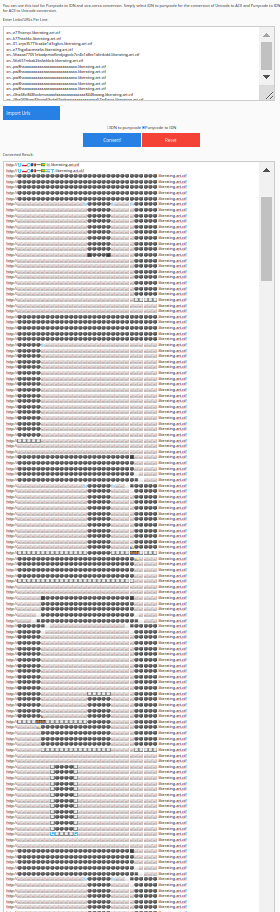

By the way, the mushroom at the start are now very nice looking!#
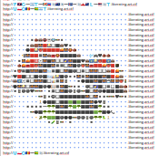

We can keep reading the flag, as such:\
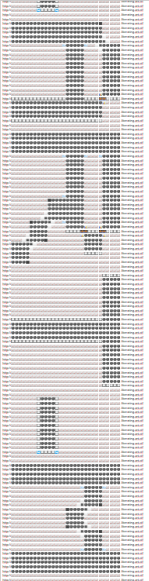

We then end up with:
> FLAG-ART-MUSHROOM-ARE-HIDDEN-IN-PLAIN-SIGHT

Flag submission:
```
Portobello 53 - Depression (2/3) |     1 | Is a VFT screenshot actually art theft? (2/3)
```

Forum message:
```
Users are stealing artwork and VFTs from the Mycoverse. I need to tell the cyberpolice.
```

At the absolute end, we get those:\
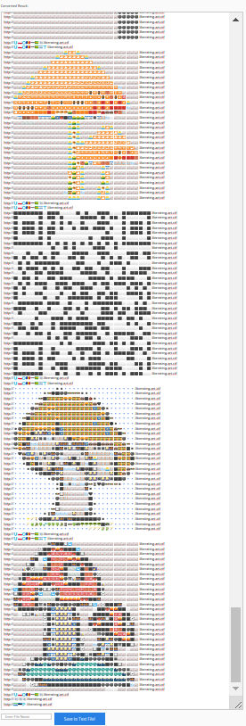

That last command is SLEEP, but before that, we can see a nice QR Code. I say nice, but trying to read it using 5 to 10 tools, including my phone, were all unsuccessful.\
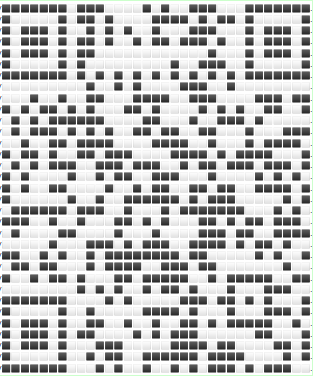

Knowing that the first thing the readers need to parse a QR Code is to recognize the Finder Patterns, and the Alignment Pattern. I did a quick and dirty work in Pinta to make sure those were clear enough:\
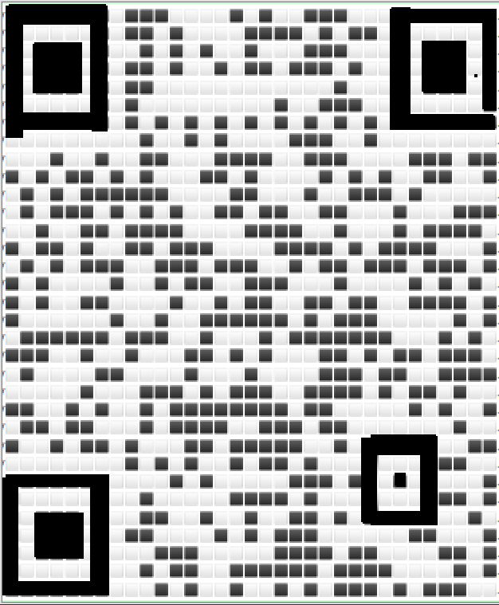

With those modifications, my phone was able to read it and give me the last flag.
> FLAG-ART-EXFIL-METHOD-IS-TRUE-MASTERPIECE

Flag submission:
```
Portobello 53 - Depression (3/3) |     3 | Why invest in YRR when their art can be stolen that easily? Good grief. (3/3)
```

Forum message:
```
That is another level of obfuscation that our AI-based appliance was not ready to deal with.
```